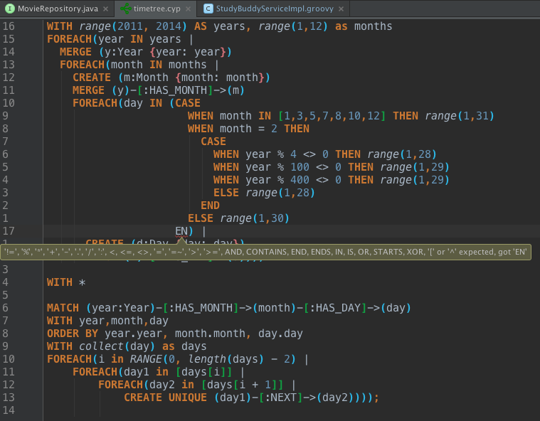

Cypher Intellij Plugin
======================
[](https://huboard.com/FylmTM/intellij-plugin-cypher)

Plugin provides [Cypher](http://www.opencypher.org/) query language support for Jetbrains IDE family.

**WARNING:** Currently plugin is in alpha-stage.
If any bugs, incompatibilities or other issues occurs - report by creating issue on Github.

# Features

* Cypher query highlight in `.cyp` files
* Customizable Cypher highlight 
* Cypher language injection into other language strings (Java, PHP, ...)
* Parser errors for invalid Cypher queries
* Automatic Cypher language injection into
  * Neo4j `GraphDatabaseService::execute` methods
  * SDN `@Query` annotations
  * Neo4j OGM `Session` class - `queryForObject`, `query` and `execute` methods.

# Installation

Plugin is available via Jetbrains repositories.

Go to `Preferences` -> `Plugins` -> `Browser repositories...` and search for "Cypher".
Install plugin and restart your IDE.

# Supported Jetbrains products

* IntelliJ IDEA - **tested**.
* RubyMine
* WebStorm
* PhpStorm
* PyCharm
* AppCode
* Android Studio
* 0xDBE
* CLion

Plugin is not tested (yet) with all existing Jetbrains products. However it should work
without any issues.

# Known issues

* Using keyword or function name as identifier will break lexer.

# Screenshots

Screenshot contains several custom highlight settings.



# Roadmap

1. Stabilize grammar.
2. Make parser errors readable.
3. Code completion.
4. References (find usages/renaming/etc).
5. Grammar error recovery tuning.

# Development

Gradle is used as build system. 

```shell
# Build plugin distribution
./gradlew buildPlugin 

# Run idea in development mode
./gradlew runIdea
```

### Grammar

Cypher grammar is located here - `src/main/java/com/neueda4j/intellij/plugin/cypher/lexer/Cypher.bnf`

After grammar change:

* Generate parser code for grammar
* Generate jFlex `.lexer` for grammar
* Generate lexer code from `.lexer`

# License

Copyright © 2015 Dmitry Vrublevsky

Released under the Apache 2.0 License.

